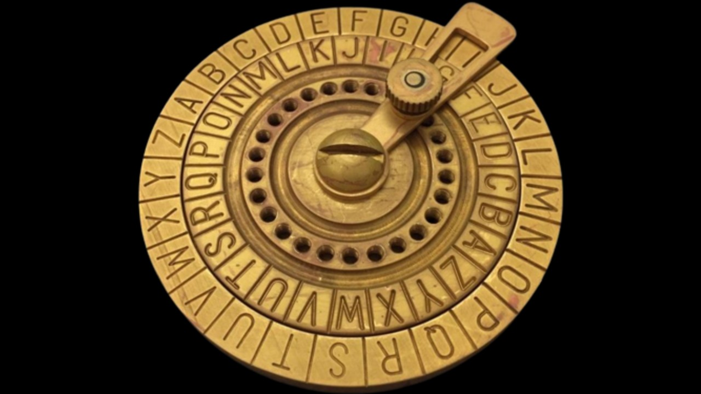

# 🔐 Caesar Cipher — Keep your secrets as a Roman 

This project implements the **Caesar Cipher**, one of the oldest encryption algorithms.  
It allows you to **encrypt** and **decrypt** messages by shifting letters in the alphabet.

 

The Caesar Cipher replaces each letter with another that appears a certain number of positions ahead or behind in the alphabet.  
Example with shift = 3: 

Original text: hello
Encrypted text: khoor

The program supports three actions:  
- **Encrypt (1):** encode a message.  
- **Decrypt (2):** decode a message.  
- **Exit (N):** quit the program.  

The main function `ceasar()` applies the shift for both encryption and decryption, depending on the parameter provided.  
The script runs an interactive loop in the terminal that asks for input, shift key, and operation mode.  

### Usage
Clone the repository and run the script:

```bash
python caesar_cipher.py

Example run:

What do you want to do?
1- Encrypt text
2- Decrypt text
N - Exit

> 1
Text: hello
Key: 3
Your secret is safe:  khoor