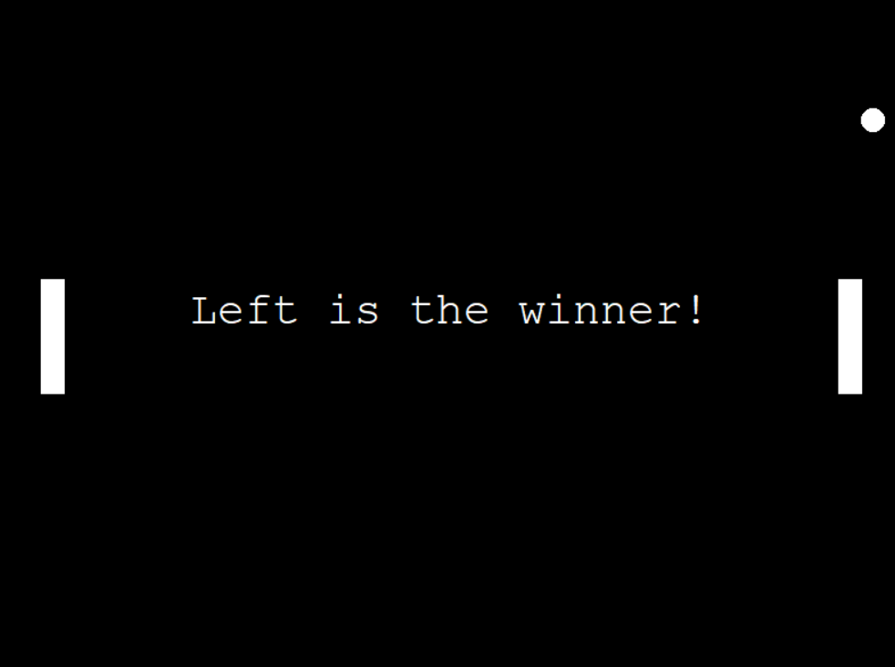

# 🕹️ Pong Game in Python



A simple and fun **Pong** game built with Python using the `turtle` module. The goal is to score points by making the ball pass your opponent. The game ends when one player reaches 3 points.

---

## 🎮 How to Play

- **Right Player** uses:
  - `↑` to move up
  - `↓` to move down
- **Left Player** uses:
  - `W` to move up
  - `S` to move down

---

## 🚀 Requirements

- Python 3.x

This game only uses Python’s standard libraries. No external dependencies are needed.

---

## ▶️ Run the Game

Simply run the `main.py` file:

```bash
python main.py
```

---

## 🧠 Project Structure

```
pong-game/
├── main.py          # Main game loop and logic
├── paddle.py        # Paddle class
├── ball.py          # Ball class
├── scoreboard.py    # Scoreboard class
└── cover.png        # Project cover image
```

---

## 📸 Preview


---

## ✨ Features

- Wall and paddle collision detection
- Automatic scoring system
- Game Over screen with winner display
- Increasing difficulty as the game progresses

---

## 📚 Learning Highlights

This project is a great way to practice:
- Object-Oriented Programming
- Collision detection
- Basic game development with `turtle`
- Game loop and real-time logic

---

## 📄 License

This project is open-source and free to use for educational and personal purposes.

---