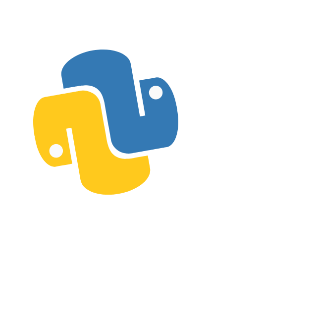

# Python Mini Projects 🐍

 

This repository contains a collection of **Python mini projects** developed as part of the  
**"100 Days of Code: The Complete Python Pro Bootcamp"** (Udemy).  

Each project focuses on different programming concepts, ranging from simple scripts to more structured applications using **Object-Oriented Programming (OOP)** and modular design.

---

## 🚀 Getting Started

Clone this repository and move into the desired project folder:

```bash
git clone https://github.com/your-username/python-mini-projects.git
cd python-mini-projects/Quiz-Game
python main.py
```

## 🛠️ Topics Covered

Python basics (variables, loops, conditionals, functions)
Object-Oriented Programming (classes, methods, attributes)
Modularization and project structuring
User input handling
Basic data structures (lists, dictionaries)
