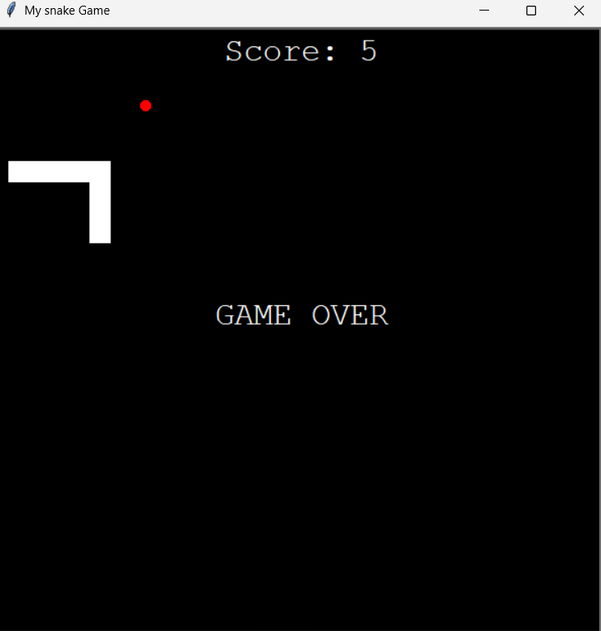

# 🐍 Snake Game



A simple and fun Snake game built using Python's `turtle` graphics module.  
Eat the food, grow your snake, and avoid hitting the walls or yourself!

---

## 🚀 How to Run

1. Make sure you have Python installed (**version 3.6+** recommended).
2. Clone this repository:
   ```bash
   git clone https://github.com/your-username/snake-game.git
   cd snake-game
   ```
3. Run the game:
   ```bash
   python main.py
   ```

---

## 🎮 Controls

- ⬆️ Up Arrow – Move Up  
- ⬇️ Down Arrow – Move Down  
- ⬅️ Left Arrow – Turn Left  
- ➡️ Right Arrow – Turn Right

---

## 🐍 Features

- ✅ Classic Snake mechanics  
- ✅ Real-time score tracking  
- ✅ Persistent high score stored in `data.txt`  
- ✅ Food appears at random positions  
- ✅ Collision detection with walls and tail  
- ✅ Clean and modular code structure  

---

## 📂 Project Structure

```bash
snake-game/
│
├── cover.png          # Project cover image
├── main.py            # Game loop and setup
├── snake.py           # Snake logic and movement
├── food.py            # Food generation and placement
├── scoreboard.py      # Score display and high score logic
└── data.txt           # Stores the high score between sessions
```

> ⚠️ **Note:** The `data.txt` file should contain only an integer (e.g., `0`) and must be in the same directory as `scoreboard.py`. It is created/updated automatically by the game.

---

## 📦 Requirements

This game uses only Python's built-in libraries — no external dependencies needed:

- `turtle`  
- `random`  
- `time`  
- `os`