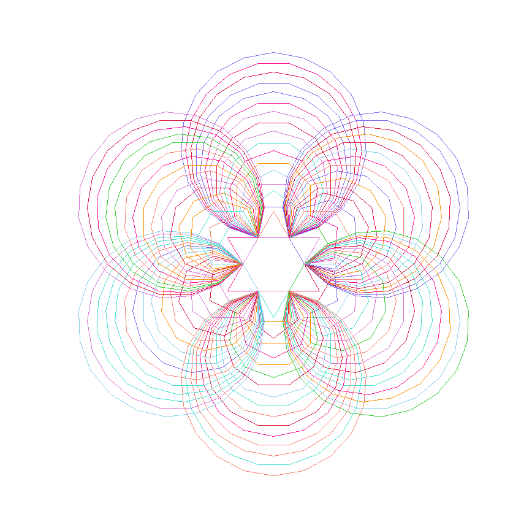
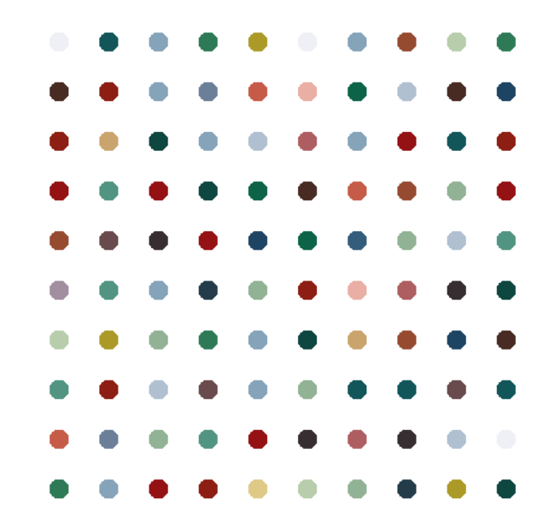

# 🐢 Turtle Geometry Gallery

Welcome to the **Turtle Geometry Gallery** — a collection of creative and colorful Python turtle graphics experiments.  
Each file in this repository produces a unique geometric or artistic pattern using the `turtle` module, perfect for exploring programming with visual feedback.

<p align="center">
  
</p>

---

## 📁 Projects Included

### 🟡 `Davi_Star.py`

A rotational geometric construction inspired by the *Star of David* and recursive polygonal symmetry.  
Each layer builds upon complex rotations with varying polygon sides.

- Colorful star-burst pattern
- Increasing polygon sides
- Radial rotation for full symmetry

---

### 🎨 `Hirst_painting.py`

Inspired by **Damien Hirst's** spot paintings.  
This script generates a grid of colored dots using an extracted color palette.

- 10x10 grid of colorful dots
- Based on real artwork aesthetics
- Uses RGB color values

---

### 🌀 `Random_Walk.py`

Simulates a chaotic yet beautiful random walk.  
A turtle moves randomly in cardinal directions, leaving a colorful trail behind.

- Random RGB color generation
- Directional changes (0°, 90°, 180°, 270°)
- Organic, freeform structure

---

### 🌐 `Spirograph.py`

Generates layered spirograph-style arcs and circles.  
Combines partial circles and full spirals with controlled color variation.

- Uses circular symmetry (3, 5 sides, etc.)
- Layers of 180° arcs
- Built for pleasing rotational symmetry

---

## 🖼️ Output Previews

All output images can be found in the [`assets/`](./assets/) folder.

---

## 🚀 How to Run

Make sure you have Python installed. No extra libraries are required beyond the standard `turtle` and `random`.

To run a script:

```bash
python Davi_Star.py
```

Each script will open a turtle graphics window.
Click anywhere on the window to close when finished.

## 🎯 Requirements

Python 3.x

Works on all major platforms (Windows, macOS, Linux)

## 💡 Ideas to Expand

Export each drawing to SVG or PNG
Animate transitions between patterns
Generate audio-reactive visuals
Add GUI controls to tweak parameters in real time

## 📸 Preview

Below is a preview of one of the rendered artworks:

<p align="center">  </p>