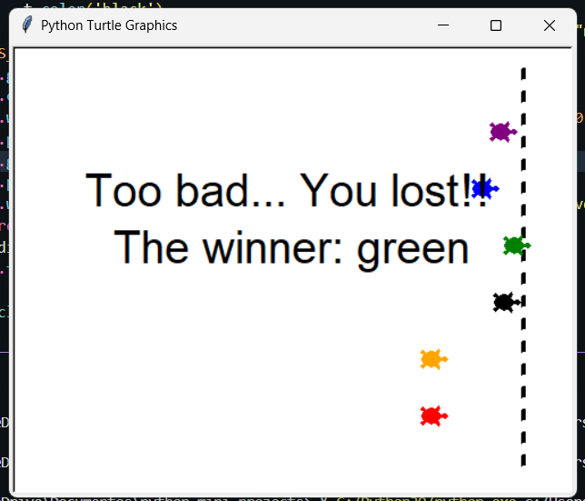

# 🐢 Turtle Races!!!



A colorful, animated turtle race built using Python’s `turtle` graphics library!  
Place your bet and cheer for your favorite turtle as they race across the screen.  
Simple, fun, and a great intro to basic graphics, animation, and user input in Python.

---

## 🎮 How It Works

- You're prompted to **bet on a turtle** by choosing a color.
- Six turtles (each with a unique color) line up and start racing across the screen.
- The winner is announced at the finish line.
- If your bet was right, you win — otherwise, better luck next time!

---

## 🧠 Features

- Uses Python’s built-in `turtle` module (no external dependencies)
- Smooth animation using `tracer()` and `update()` for performance
- Basic UI for user interaction (`textinput()` prompt)
- Randomized race outcome every time

---

## 🐍 Requirements

- Python 3.x  
- No additional libraries needed — just run the script!

---

## ▶️ Running the Project

### 1. Clone the repository:

```bash
git clone https://github.com/your-username/turtle-races.git
cd turtle-races
```

### 2. Run the game:

```bash
python turtle_race.py
```

Enter your bet when prompted (choose one of: red, orange, black, green, blue, purple)
Enjoy the race!

